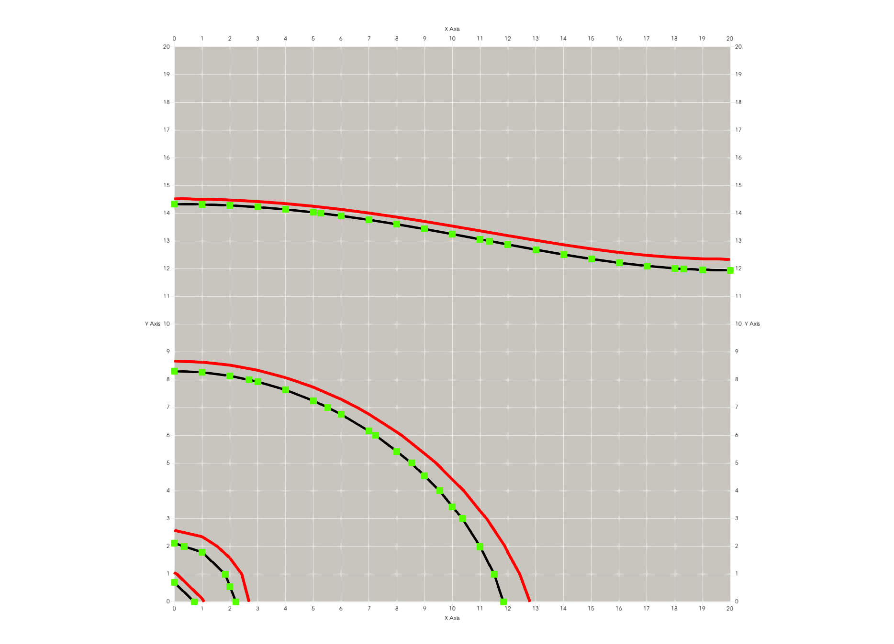

# darcy2D

**2D Test Darcy and Non-Darcy flow in Liquid Water and Gas**

The use of Darcy’s law in subsurface porous flow models is nearly universal.  However, there are important applications where Darcy's law is not valid. Flow in fractures and flow near pumping or extraction wells are applications where Non-Darcy flow models are often required.  
The code uses a fully implicit non-Darcy implementation with a control volume  finite volume code (or control volume finite difference code) with a minimum of coding that allows for general non-darcy models. 

Using the data from Zeng and Grigg (2006), these tests were designed to confirm the validity of the implementation. Both gas and liquid water pumping were examined in a 2D problem intended to approximate a pump test. Tests included here are Liquid Darcy, Liquid non-Darcy, Gas Darcy, and Gas non-Darcy.

<!-- Begin image --> 
<p><a href="../../../../fehmpytests/darcy2D/_information/contour_darcy_m9_m6.png">  </a></p>
<!-- End image -->
Figure 1. Solution domain and pressure contour comparison darcy (black line), non-darcy beta=1.d9 (red line), and non-darcy beta=1.d6 (green dots). Contour lines starting at lower left corner are MPa 2.8, 2.0, 1.0, and .5 furthest away from corner. Click on image for full view.

## Example macro ndar

The macro **ndar** is used to set non-darcy flow. The keyword *off* can be used to skip the macro and flow will be Darcy as usual. 

In this example, ```1 441 1``` is the node number start,stop,stride. ```1.0d9``` is the flow model which can be 1.d10, 1.d06, 1.0d9, and Beta default 1.d-15. Note for this test, 1.d06 is similar to the Darcy result, and 1.0d9 is slightly different (red lines in Figure 1).

<pre>
ndar
1 441 1 1.0d9

end ndar

or
ndar OFF (to skip non-darcy)
</pre>


## Reference

Document by George and Dolan pending.
 

Test Directory: [FEHM/fehmpytests/darcy2D](https://github.com/lanl/FEHM/tree/master/fehmpytests/darcy2D)

