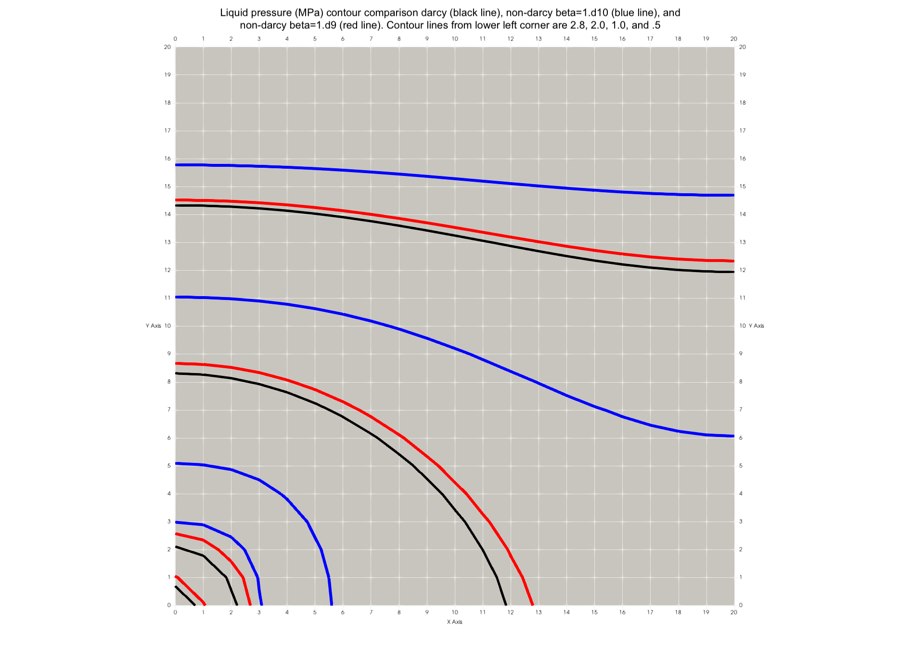

# non_darcy

**Test 2D Darcy and Non-Darcy Liquid and Gas**

This tests non linear flow using the macro **ndar**

Using the data from Zeng and Grigg (2006), these tests were designed to confirm the validity of the implementation. Both gas and liquid water pumping were examined in a 2D problem intended to approximate a pump test. Tests compare Darcy flow results with non-Darcy runs.

<p> Image shows liquid pressure comparisons for each Darcy and non-Darcy test. <br>
  Darcy (black), non-Darcy beta 1.d09 (Red), and non-Darcy beta 1.d10 (Blue)<br>
 <a href="./_information/contour_darcy_m9_m10.png">  </a> 
</p>


More images are in this test directory under [_information](./_information/)


## Example macro ndar

The macro **ndar** is used to set non-darcy flow. The keyword *off* can be used to skip the macro and flow will be Darcy as usual. 

In this example, ```1 441 1``` is the node number start,stop,stride. ```1.0d9``` is the flow model which can be 1.d10, 1.d06, 1.0d9, and Beta default 1.d-15. Note for this test, 1.d06 is similar to the Darcy result, and 1.0d9 is slightly different (red lines in Figure 1).

<pre>
ndar
1 441 1 1.0d9

end ndar

or
ndar OFF (keyword **OFF** is used to skip a macro)
</pre>

## Example macro cont with vtk

The vtk option is available through the macro **cont**. In this example, vtk contour files are written at Time 0.0 and Time 50.0  *rootname*.00001_sca_node.vtk and *rootname*.00002_sca_node.vtk, each with contour data for Liquid Pressure (MPa) and Saturation. The pressure contour images were created using Time 0002 vtk files.

<pre>
cont
vtk     5000    1.00000e+19

</pre>


## Reference


Zeng, Z., Grigg, R. A Criterion for Non-Darcy Flow in Porous Media. Transp Porous Med 63, 57–69 (2006). [https://doi.org/10.1007/s11242-005-2720-3](https://doi.org/10.1007/s11242-005-2720-3)

Document by George and Dolan pending.

Test Directory: [FEHM/fehmpytests/darcy2D](https://github.com/lanl/FEHM/tree/master/fehmpytests/darcy2D)

Documents and Image Directory: [FEHM/fehmpytests/darcy2D/_information](https://github.com/lanl/FEHM/tree/master/fehmpytests/darcy2D/_information)
