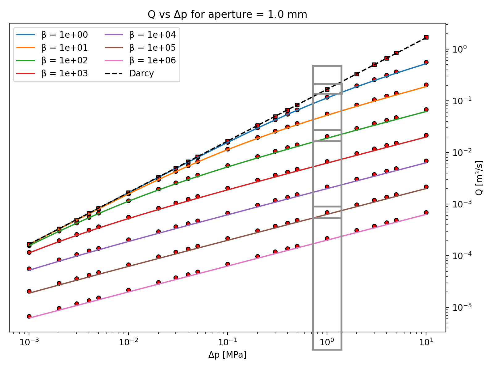
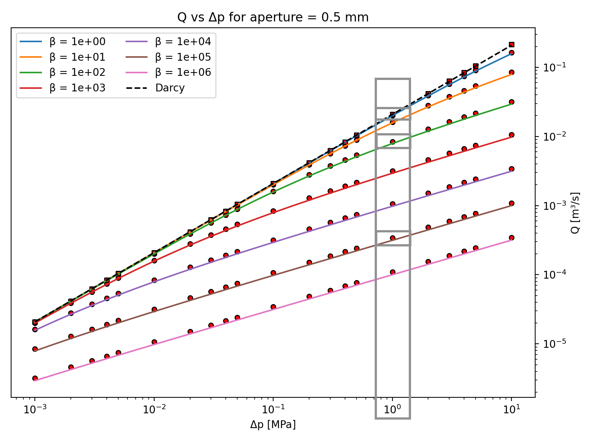
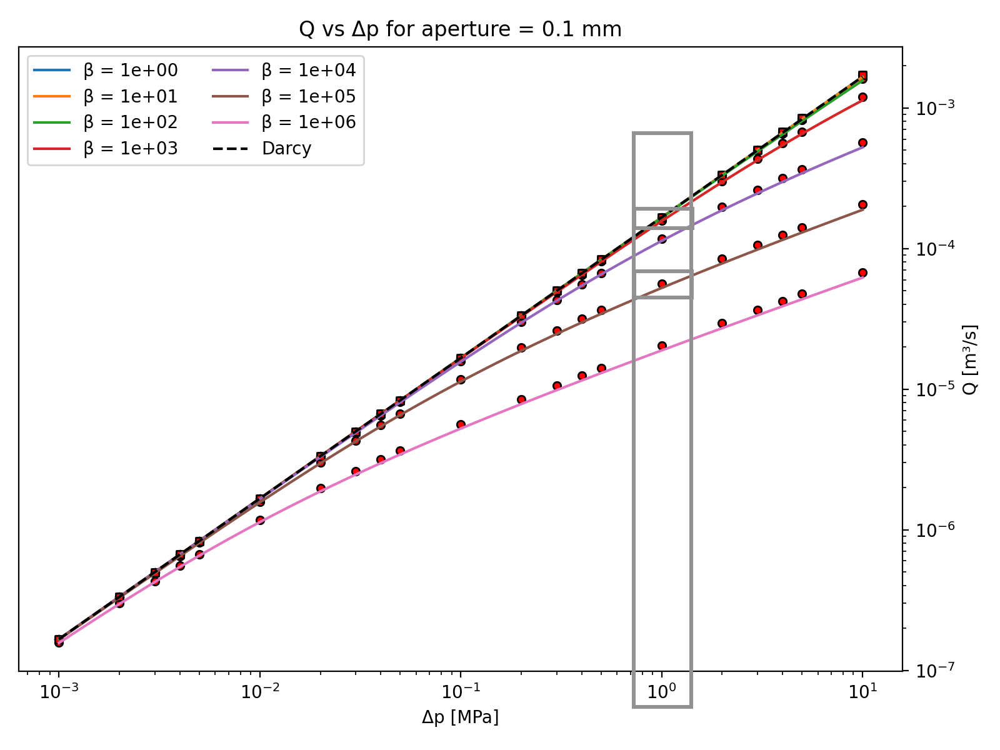
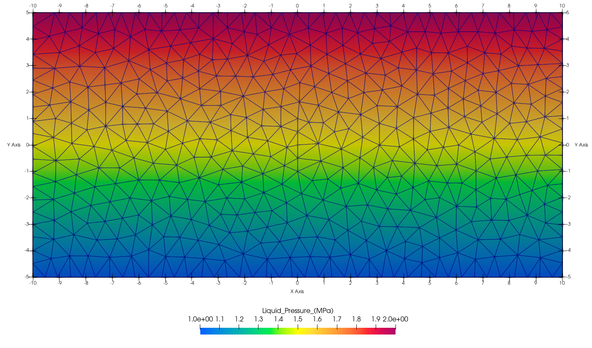

# non_darcy_dfn

**Test Darcy and Non-Darcy Water Flow in a Single dfn fracture**

This tests non linear flow using the macro **ndar** and bug fixes related to vtk output files for 2D grids in 3D space.

These are a small subset 441 test runs comparing Darcy and non-Darcy flow simulations using FEHM on a single fracture, modeled as a 2D rectangle with a thickness defined as the aperture. The input files for these simulations were created using dfnWorks, although dfnWorks is not required for running these FEHM tests. 

This test consists of 9 representative cases selected from the complete set of consisting of 441 simulation runs, which include:
    7 different beta values for the ndar macro (ranging from 1e+0 to 1e+6)
    3 different apertures (1e-3, 5e-3, and 1e-4) in mm
    21 different pressure differential (dp) values, where dp1e01 indicates a pressure change of 10 MPa.

The following are plots of all runs grouped by the 3 aperture sizes. They illustrate water discharge (Q) plotted against the change in pressure (dp). It is essential to note that Q is influenced by factors such as aperture size, permeability, and cross-sectional area, rather than just velocity/Re. The Q values represented in the plots are derived from the last time-step recorded in the run.out file and are converted to cubic meters per second (m³/s) by dividing by the water density of 998 kg/m³. This density, denoted as rho, is defined in the FEHM input deck, assuming a constant temperature of 20°C. 

**Plots show Q vs Dp[MPa] for apeture 1.0mm, 0.5mm, and 0.1mm**

The gray boxes are the runs selected for fehmpytests. There are 9 runs with dp at dp 1e00, for beta 1e+2, 1e+5, and Darcy for 3 apetures.

 
  
     
     

Click to enlarge.

Python scripts were used to create run directories and the files for FEHM runs. The FEHM input decks for each run were modified to control the darcy or non-darcy run. The ndar macro defines the beta value used, changes in pressure differential (dp) are made by modifying the pressures in the flow macro zones. The aperture is adjusted bynaming one of the three different area/volume stor file in the fehmn.files list.

The fracture mesh and associated setup files were created using dfnWorks. The single fracture is a 20 x 10 meter triangulated rectangle with edge lengths near .5m
Image shows Liquid Pressure (MPa) at the final time step of 50 days for Darcy Flow on the 1.0mm fracture.

 
  

Run these 9 tests with the following:

*python fehmpytests.py ../src/xfehm non_darcy_dfn* 

The following directories will be created using the following naming convention:
A1 = aperture e1e-3 = 0.001
A2 = aperture e5e-4 = 0.0005
A3 = aperture e1e-4 = 0.0001
B2 = ndar beta = 1.0e+02
B5 = ndar beta = 1.0e+05

<pre>
A1B2_dp1e00_output   A1B5_dp1e00_output   A1Darcy_dp1e00
A2B2_dp1e00_output   A2B5_dp1e00_output   A2Darcy_dp1e00
A3B2_dp1e00_output   A3B5_dp1e00_output   A3Darcy_dp1e00
</pre>

LANL server locations:
nondarcy runs: /scratch/er/mdalal/nondarcy/batch_runs
darcy runs: /scratch/er/mdalal/nondarcy/darcy_batch_runs

Credit: Jeffrey De'Haven, Matthew Sweeney, Dolan Lucero, Maitri Vijay Dalal, Phil Stauffer Paper pending

